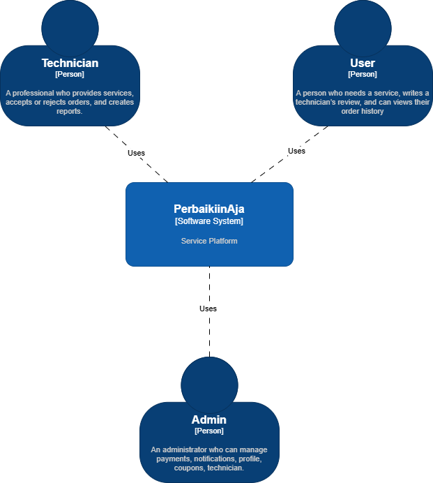
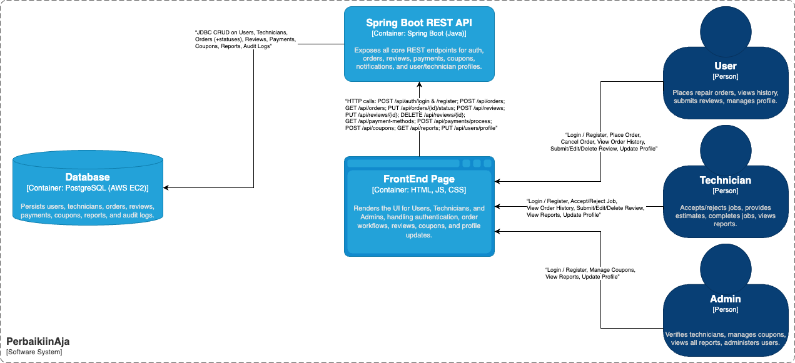
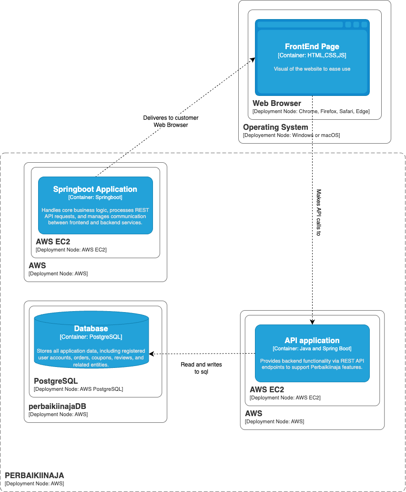
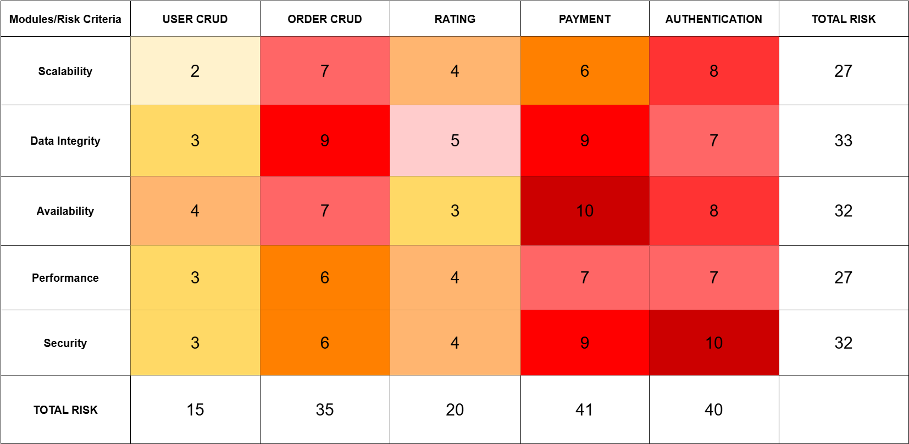
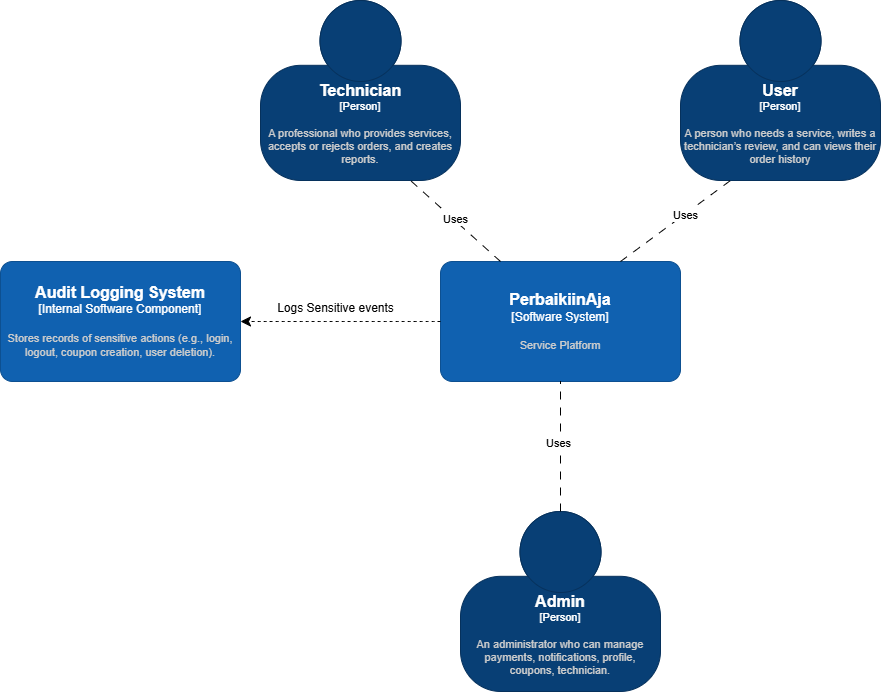
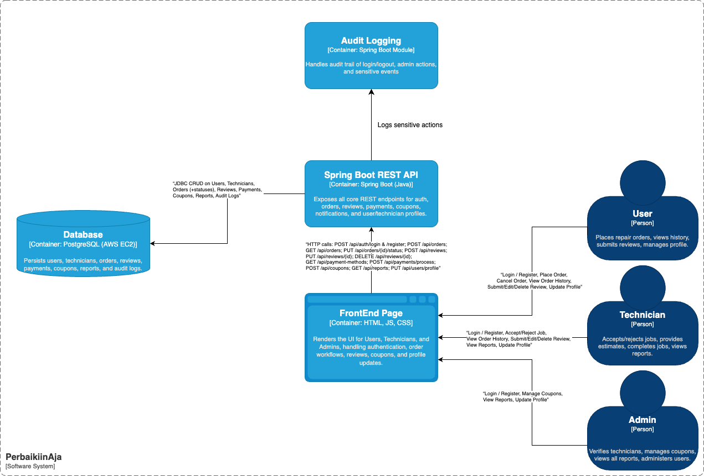
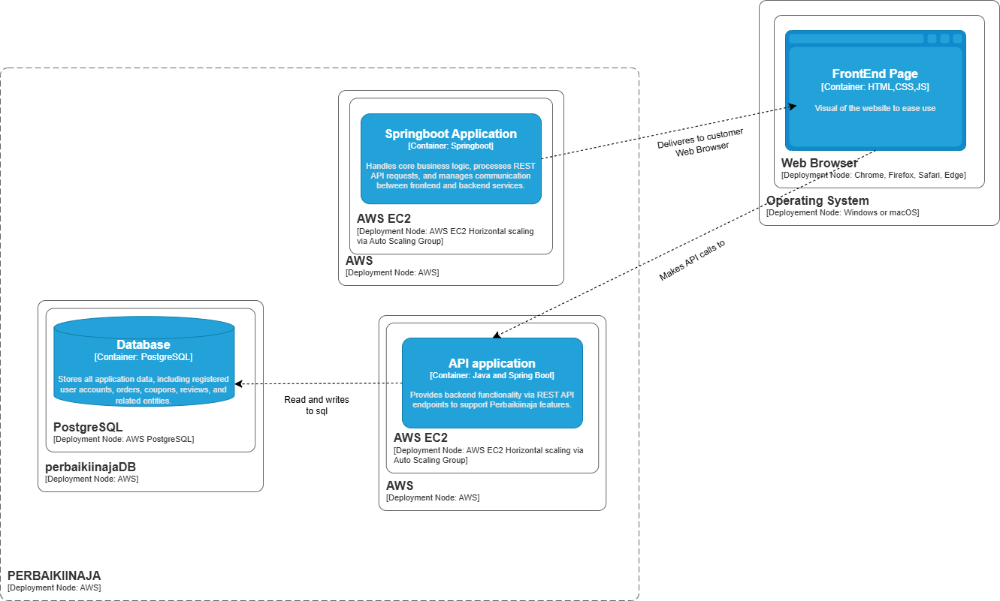
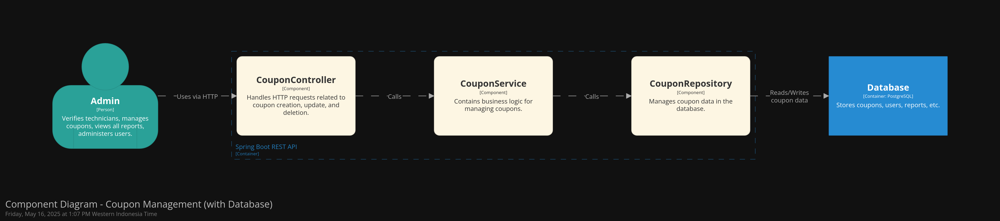
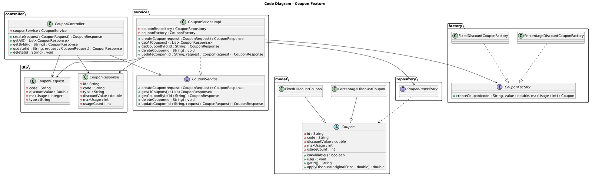

# PerbaikiinAja

---
### *Before pushing to main we pushed on branch develop:)*

---

### PerbaikiinAja System Architecture

This documentation provides an overview of the PerbaikiinAja service system using three architectural perspectives: **Context Diagram**, **Container Diagram**, and **Deployment Diagram**. The system is built using Spring Boot (Java), a web frontend (HTML, JS, CSS), and PostgreSQL, and is deployed entirely on AWS EC2.

---

## 1. Context Diagram

The Context Diagram illustrates the external actors and how they interact with the PerbaikiinAja system:

- **User (Customer)**:
  - Places and cancels repair orders
  - Submits and edits reviews
  - Views order history and manages profile

- **Technician**:
  - Accepts or rejects jobs
  - Completes orders and writes reports
  - Manages their profile

- **Admin**:
  - Verifies technicians
  - Manages coupons
  - Views all reports and user activities

All actors use the system through a centralized application interface, which handles the orchestration of their interactions.

---

## 2. Container Diagram

The Container Diagram breaks down the PerbaikiinAja system into three main components:

- **FrontEnd Page [HTML, JS, CSS]**
  - Renders the UI for all roles (Users, Technicians, Admins)
  - Handles authentication, order management, reviews, coupons, and profile updates

- **Spring Boot REST API [Java]**
  - Provides core REST endpoints:
    - `/api/auth/login`, `/register`
    - `/api/orders`, `/api/orders/{id}/status`
    - `/api/reviews`, `/api/reviews/{id}`
    - `/api/payments`, `/api/coupons`, `/api/reports`
    - `/api/users/profile`
  - Handles all business logic and connects to the database via JDBC

- **Database [PostgreSQL on AWS EC2]**
  - Stores persistent data for:
    - Users, Technicians
    - Orders & statuses
    - Reviews & Reports
    - Payments, Coupons, Audit Logs

---

## 3. Deployment Diagram

The Deployment Diagram shows the infrastructure setup of PerbaikiinAja on AWS:

- **Frontend Page**
  - Runs on users’ web browsers (Chrome, Firefox, Safari, Edge) on Windows/macOS
  - Loads HTML/CSS/JS from the backend server

- **Spring Boot Application [AWS EC2]**
  - Hosts the backend services, processes REST API calls, and applies business logic

- **Database [AWS EC2 - PostgreSQL]**
  - Handles data storage and retrieval through SQL connections from the backend

### Communication Flow:
- Users interact with the system via browsers
- Browsers send REST API requests to the Spring Boot server
- The server reads/writes data to PostgreSQL
- Static frontend content is delivered to the browser from the same backend server

## After Risk Analysis

### Context Diagram

### Container Diagram

### Deployment Diagram

---
Risk Storming is a technique used to systematically identify, evaluate, and prioritize potential risks within a software architecture, enabling teams to address vulnerabilities early in the development process. By analyzing each architectural component, such as potential performance bottlenecks in the API or security gaps in the authentication system, teams can design more targeted and effective safeguards like role-based access control, audit logs, and scalability solutions.

In the PerbaikiinAja system, applying Risk Storming led to important architectural decisions including implementing horizontal scaling through an Auto Scaling Group to handle varying loads efficiently and introducing an internal audit logging module to track sensitive operations. These enhancements directly address key risk areas, ensuring the application remains stable, secure, and accountable during real-world use.

## 4. Individual Component Diagrams

### Feature Coupons

## 🛠️ Tech Stack Overview

| Layer       | Technology Used          |
|-------------|---------------------------|
| Frontend    | HTML, CSS, JavaScript     |
| Backend     | Spring Boot (Java)        |
| Database    | PostgreSQL                |
| Hosting     | AWS EC2                   |
| Communication | REST API (HTTP/JSON)   |

---

## 👥 Role Summary

| Role       | Responsibilities                                                   |
|------------|---------------------------------------------------------------------|
| **User**       | Register, Login, Place/Cancel Orders, Write Reviews, View History  |
| **Technician** | Accept/Reject Orders, Complete Jobs, Submit Reports              |
| **Admin**      | Manage Users & Technicians, View Reports, Manage Coupons         |

---

PerbaikiinAja provides an integrated platform to streamline the repair service lifecycle between customers, technicians, and administrators—securely hosted and deployed in the cloud.
---

## Table of Contents
- [Overview](#overview)
- [Version & Authors](#version--authors)
- [Work Distribution](#work-distribution)
- [Summary](#summary)
- [User Roles](#user-roles)
- [Functional Requirements](#functional-requirements)
    - [Use Case: Placing a Repair Service Order](#use-case-placing-a-repair-service-order)
    - [Use Case: Editing Profile](#use-case-editing-profile)
- [Module Flow Examples](#module-flow-examples)
    - [Confirm Repair Services](#confirm-repair-services)
    - [Reviews and Rating](#reviews-and-rating)
- [Non-Functional Requirements](#non-functional-requirements)
- [Proposed Low-Level Architecture](#proposed-low-level-architecture)
    - [Components Overview](#components-overview)
    - [Modules & Services](#modules--services)
    - [Low-Level Class Diagram](#low-level-class-diagram)
- [API Design](#api-design)
- [Alternate Solutions & Scalability](#alternate-solutions--scalability)
- [Execution Plan / Cost Estimation](#execution-plan--cost-estimation)
- [Production Readiness](#production-readiness)
- [Mandatory & Optional Features](#mandatory--optional-features)
- [Data & Roles Details](#data--roles-details)
- [References & PIC](#references--pic)

---

## Overview

PerbaikiinAja is a repair service application that enables users to order repair services, choose technicians, view estimated completion times and pricing, and provide reviews and ratings after the job is completed. The application supports various modules such as authentication, order management, payment management, notifications, and user profile management.

---

## Version & Authors

**Version:** 1.0  
**Authors:** -  
**Date:** 26-03-2025  
**Notes:** First version of the template

---

## Work Distribution

- **Authentication**
    - **Brian:** Place a Repair Service Order and Accepting
    - **Kayla:** Confirming Repair Services
    - **Nayaka:** Reviews and Rating and Accepting
    - **Ameera:** Payment Management
    - **Azim:** Viewing Reports & Managing Coupons

**Additional Features:**
- **Brian:** Notification for Completed Tasks & Remove Notifications
- **Ameera:** UI Design & Favorite Technician
- **Nayaka:** Best Technician based on Rating Reviews

---

## Summary

PerbaikiinAja is an application that facilitates repair service orders with features such as:
- Ordering and managing repair service requests.
- Technician selection (default random assignment, or user selection if the optional feature is implemented).
- Technicians provide estimated repair time and cost.
- Integration with a Payment Gateway and an Email/Notification Server.
- User profile management, review and rating system, and work report management.
- Three primary roles: **Admin**, **Technician**, and **User**.

The system is integrated with a CI/CD pipeline (e.g., GitHub Actions) and code quality checks (SonarQube).

---

## User Roles

- **Admin:** Responsible for overall data management and technician verification.
- **Technician:** Responsible for servicing items, providing repair time estimates, and repair costs.
- **User:** Places service requests for repairs and provides reviews after service completion.

---

## Functional Requirements

### Use Case: Placing a Repair Service Order

- **Order Placement:**
    - The user fills in the details of the item to be repaired (item name, condition, issue description, service date, and coupon option).
    - The user selects a payment method, which will display related information (e.g., bank name and account number).

- **Technician Assignment:**
    - By default, a technician is assigned randomly.
    - *(Optional)* The user may choose a technician from an available list.

- **Order Confirmation:**
    - The technician provides an estimated repair time and cost.
    - The user can either accept or reject the estimation.
        - If rejected, the order is canceled and the user can place a new order.

- **Order Cancellation:**
    - The user can cancel the order if the technician has not yet approved the service request.

### Use Case: Editing Profile

- The user navigates to the profile menu to view complete information (name, profile picture, and other details).
- The user clicks the pencil icon to edit their information.
- Input validation (ensuring non-empty and correctly formatted data) is performed before saving.
- If validation fails, the system displays an error notification.
- Access to the profile page is available only after the user logs in.

---

## Module Flow Examples

### Confirm Repair Services

1. Technician logs in to the application.
2. Technician views all incoming service requests.
3. Technician accepts the order and provides an estimated time and cost.
4. The user accepts or rejects the estimation.
5. Technician performs the service and changes the order status to completed.
6. A service report is generated, and the technician's completed job count is automatically updated.

### Reviews and Rating

1. **Order Completed & Submit Review:**  
   After the order is completed, the user submits a review and rating.
2. **View Reviews:**  
   All reviews are displayed and accessible by both users and admin.
3. **Modify Review (Decision Flow):**
    - Should the review be modified?
        - **No:** The process ends.
        - **Yes:** The user may choose to update or delete their review, while the admin can delete the review directly.

---

## Non-Functional Requirements

- **Performance:**
    - Profile updates should occur in less than 50 ms.
    - Order processing and notification delivery must be efficient even with large amounts of data.

- **Scalability:**
    - The modular design allows new features to be added without disrupting existing modules.
    - Backend services can scale horizontally.

- **Security:**
    - Strong authentication and authorization mechanisms are required for every endpoint.
    - Sensitive data, such as passwords and payment information, must be encrypted.

- **Maintainability:**
    - The codebase must be clear, well-documented, and meet quality standards verified by SonarQube.

- **Availability:**
    - The system targets a minimum uptime of 99.9%.

---

## Proposed Low-Level Architecture

### Components Overview

- **External Actors:**
    - Users, Technicians, Admin

- **System Containers:**
    - User Interface (Web/Mobile App)
    - Technician Interface
    - Admin Panel

- **Backend API:**
    - Modules including Authentication, Order Management, Payment Management, Notification, Review & Rating, Coupon & Reporting, Profile Management, and Technician Management.

- **Database:**
    - Supabase (PostgreSQL) serves as the primary database.

- **Deployment:**
    - The system is deployed on Koyeb.

- **External Systems:**
    - Payment Gateway and Email/Notification Server.

- **CI/CD & Code Quality:**
    - GitHub Actions for build, test, and deployment.
    - SonarQube for code quality analysis.

### Modules & Services

- **Authentication Service:** Handles registration, login, logout, and user verification.
- **Order Management Service:** Records repair service orders, manages status updates, and allows cancellations.
- **Payment Management Service:** Manages payment methods and transaction validations.
- **Notification Service:** Sends notifications to users (e.g., when a repair is completed).
- **Review & Rating Service:** Captures user reviews and ratings.
- **Coupon & Reporting Service:** Manages promotional coupons and work reports.
- **Profile Management Service:** Manages user and technician profile data.
- **Technician Management Service:** Manages technician data, including updates on completed jobs and earnings.
- **Favorite Technician Service:** Manages users’ lists of favorite technicians.

### Low-Level Class Diagram

**User**
- Attributes: `id`, `name`, `email`, `phone number`, `password`, `address`, `profile picture`

**Technician (extends User)**
- Additional Attributes: `experience`, `total completed jobs`, `total earnings`

**Admin (extends User)**

**Order**
- Attributes: `id`, `user_id`, `technician_id`, `item details`, `service date`, `status`, `estimated time`, `repair cost`, `payment method`, `coupon (optional)`

**Payment**
- Attributes: `id`, `method`, `account number`, `transaction status`

**Review**
- Attributes: `id`, `order_id`, `user_id`, `rating`, `review text`, `date`

**Coupon**
- Attributes: `id`, `code`, `discount`, `usage limit`

---

## API Design

| No | API Type   | Scope    | Endpoint                         | Documentation |
|----|------------|----------|----------------------------------|---------------|
| 1  | Public     | Auth     | `/api/auth/register`             | [API Doc](#)  |
| 2  | Public     | Auth     | `/api/auth/login`                | [API Doc](#)  |
| 3  | Internal   | Order    | `/api/orders`                    | [API Doc](#)  |
| 4  | Internal   | Payment  | `/api/payment/methods`           | [API Doc](#)  |
| 5  | Internal   | Profile  | `/api/users/profile`             | [API Doc](#)  |
| 6  | Internal   | Order    | (Endpoint details pending)       | [API Doc](#)  |

---

## Alternate Solutions & Scalability

- **Alternate Frameworks:**
    - Consider alternative frameworks (e.g., Django for Python) if performance issues arise.
- **Database Alternatives:**
    - Although PostgreSQL (via Supabase) is the primary choice, a NoSQL database may be considered for highly dynamic schemas.
- **Scalability:**
    - The modular architecture supports the addition of features without affecting existing modules.
    - Backend services can scale horizontally with a load balancer.
    - Supabase supports vertical scaling and replication for improved performance.

---

## Execution Plan / Cost Estimation

**Authentication:**
- Implement the User model with validation – **3 SP**
- Implement features to differentiate between User and Technician – **2 SP**
- Create separate pages for Technician and User – **3 SP**
- Implement guest registration for users – **2 SP**
- Implement Admin account creation for Technicians – **2 SP**
- Implement login functionality – **1 SP**
- Implement logout functionality – **1 SP**

**Place a Repair Service Order:**
- Implement data entry for the item to be repaired and payment method selection – **(Further breakdown needed)**
- Integrate with order cancellation and technician confirmation features.

**Accepting & Confirming Repair Services:**
- View incoming orders – **(Further breakdown needed)**
- Create service reports – **(Further breakdown needed)**
- Provide estimation and order confirmation – **(Further breakdown needed)**

**Reviews and Ratings:**
- Users can submit reviews and ratings – **(Further breakdown needed)**
- View, update, and delete reviews – **(Further breakdown needed)**

**Viewing Reports & Managing Coupons:**
- Create, view, and delete coupons – **(Further breakdown needed)**
- View work reports – **(Further breakdown needed)**

**Payment Management Service:**
- CRUD operations for payment methods – **(Further breakdown needed)**

**Optional Features:**
- Notifications for completed tasks.
- Deleting notifications.
- Technician search and selection.
- Displaying top technicians based on ratings.
- Managing favorite technicians for users.

---

## Production Readiness

- **Deployment:**
    - The web application is deployed on a server on Koyeb.

- **Monitoring & Observability:**
    - Use Grafana to monitor request and response logs.

- **Reliability:**
    - The system is expected to correctly process 99 out of 100 requests per month.

---

## Mandatory & Optional Features

**Mandatory Features:**
- **Authentication:**
    - Registration, login, and logout for Users and Technicians (Admin accounts are hard-coded).
- **Place a Repair Service Order:**
    - Data entry for the item to be repaired, payment method selection, and technician assignment.
- **Accept & Confirm Repair Services:**
    - Technicians accept orders, provide estimates, and update order status.
- **Reviews & Ratings:**
    - Users can submit, view, update, and delete reviews.
- **Viewing Reports & Managing Coupons:**
    - Admin can create and manage coupons and view service reports.
- **Payment Management:**
    - CRUD operations for payment methods.

**Optional Features (if team size is 6, or optional for a team of 5):**
- Manual technician selection.
- Notifications for completed tasks and notification deletion.
- Profile management, including password changes.
- Displaying top technicians based on ratings.
- Managing favorite technicians for users.

---

## Data & Roles Details

### User Data

**Admin**
- ID
- Full Name
- Email
- Phone Number
- Password

**Technician**
- ID
- Full Name
- Email
- Phone Number *(editable)*
- Password *(editable)*
- Experience *(optional, editable)*
- Address *(editable)*
- Total Completed Jobs *(updated when a job is finished)*
- Total Earnings *(updated when a job is finished)*

**User**
- ID
- Full Name
- Email
- Phone Number *(editable)*
- Password *(editable)*
- Address *(editable)*

### Example Use Cases for Mandatory Features

- **Authentication:**
    - User registration.
    - Admin creates Technician accounts.
    - Login and logout.

- **Repair Service Order:**
    - Data entry for the item to be repaired.
    - View order history.
    - Modify technician or order details before approval.
    - Cancel order if the technician has not confirmed.

- **Accept & Confirm Repair Services:**
    - Technicians view incoming orders, provide estimates, and update order status.
    - Users confirm or reject the provided estimates.

- **Reviews & Ratings:**
    - Users submit reviews and ratings.
    - View submitted reviews and ratings.
    - Users and Admin can delete reviews as necessary.

- **Reports & Coupons Management:**
    - Admin can create, view, update, and delete coupons.
    - Admin views service reports submitted by Technicians.

- **Payment Management:**
    - Admin manages payment methods (CRUD operations).

---

## References & PIC

- **References:**
    - [Tukang.com](https://tukang.com/)
    - [Sejasa.com](https://www.sejasa.com/)
    - [Pin.it Resource](https://pin.it/5hS5qRTjW)

- **PIC:**
    - SON, TAR